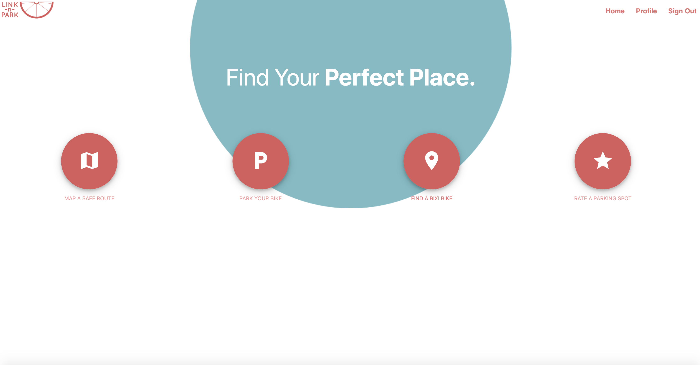

# Project 3: Link–N–Park

## Authors
* [Tobi Bailey](https://github.com/tobi-bailey)
* [Brice Boutet](BBoutet1)
* [Joel Clifford](https://github.com/joel-clifford-bootcamp)
* [Laura Gallant](https://github.com/lauragallant)
* [Massimo Guida](https://github.com/MG-cpu90)

## Description
* This full-stack react application – "Link–N–Park" – essentially allows users to locate bixi bike stations near a particular location, as well as areas to park their bike, and map a route to these locations from their current location
* The application will also allow users to rate these stations and parking areas, and add more detailed comments to expand upon their rating
* This application allows municipalities to supplement their own information with more up-to-date crowd-sourced information.
* This application will also entice users to actively contribute to the service the app offers a tangible benefit to cyclists by streamlining the process of locating parking spaces near their location and destination, and flagging issues with the underlying data; it also provides them with mapped routes.


## Features
* Secure Log-in/Sign-up
* User information is rendered in their profile page
* Ability for users to upload a profile picture to a user Profile
* Interactive buttons on the home page which bring users to separate pages which allow them to:
    * Map a route
    * Find a bixi bike station
    * Find a bike parking spot
* Ability for users to view comments on a particular Bixi bike station or bike parking spot
* Ability for users to rate a bixi bike station or bike parking spot
* Ability for users to add comments on a bixi bike station or bike parking spot
* Mobile responsive


## User Story
```
AS A bike owner USER...
I WANT...to find a safe and convenient place to park my bike,
SO THAT...I can avoid having to rely on public transit for my daily commute.

AS A bike owner USER...
I WANT...to find a place to park my bike near a desired destination,
SO THAT...I don’t have to waste time circling the area looking for a bike rack.

AS A bike rider USER...
I WANT...to find a shareable bike,
SO THAT...I can commute/get around town/be active.

AS A bike rider USER... 
I WANT...to read/write reviews of bike share stations,
SO THAT...I know the best share stations to pick up and drop off bikes.

AS A cyclist USER...
I WANT...to map my route,
SO THAT...I know my route is safe and/or efficient. 

AS A city of Toronto employee USER...
I WANT...download user data,
SO THAT...I can update existing bike data sets and gain access to updated data. 

AS A city of Toronto employee USER...
I WANT...access the platform,
SO THAT...I can download user data.

AS A city of Toronto employee USER...
I WANT...use bike data,
SO THAT...to identify areas of improvement.

```
- - -

## Acceptance Criteria
```
GIVEN I am a user...
WHEN I...open the app,
THEN...I am presented with a sign up/login page.

WHEN I...click on the sign up link,
THEN...I am asked to provide my email address and password.

WHEN I...hit the sign in button,
THEN...I am asked for my email address and password.

WHEN I...login,
THEN...I am presented with a homepage.

WHEN I...view the homepage,
THEN...I am presented with a number of options: map route, find bike, find parking, leave review.

WHEN I...select “map route”,
THEN...I am presented with a map of Toronto and asked to type in my destination.

WHEN I...type in my destination,
THEN...I am presented with a bike friendly route.

WHEN I...when I select “find bike”,
THEN I am…presented with a map of Toronto highlighting. 

WHEN I...when I select a bixi pin on the map,
THEN...I am presented with the number of bixi bikes available.

WHEN I...insert a postal code into the “search for parking spot” input bar,
THEN...I am presented with a list of parking spots that are closest to my location.

WHEN I...click on the “rate parking spot” button,
THEN...my rating affects the average rating for that particular parking spot.

WHEN I...click on the “add comment” button,
THEN...I am presented with a text area in which I can add comments on that particular spot.

WHEN I...I submit my comment,
THEN...it is posted to the database.

WHEN I...view the timeline,
THEN...I am presented with a list of cards.

```
- - -

## Application Screenshot


## Accessories Used
### Languages
* HTML
* CSS
* [Materialize CSS framework](https://materializecss.com/)
* [Google Fonts](https://fonts.google.com/)
* [fontawesome.com](https://fontawesome.com/)
* React JSX

### Programs and Applications
* [Visual Studio Code](https://code.visualstudio.com/)
* [Google Chrome](http://www.google.com/chrome)
* [MYSQL](https://www.mysql.com/) (Databases)
* [Node.js](https://nodejs.org/en/)
* Git/Terminal
* [Adobe InDesign](https://www.adobe.com/products/indesign.html)
* [Zoom](http://www.zoom.us/)
* [Slack](https://slack.com/intl/en-ca/)

### Libraries
* [chalk](https://www.npmjs.com/package/chalk)
* [node](https://www.npmjs.com/package/node-cron)

### Websites
* [GitHub](https://github.com/)
* [Heroku](https://www.heroku.com/)
* [Google](https://www.google.com) drive, docs, sheets, and slides
* [InVisionApp](https://www.invisionapp.com/) (Wireframes)
* [moqups.com](https://moqups.com/) (Wireframes)
* [W3Schools](https://www.w3schools.com/)
* [Stack Overflow](https://stackoverflow.com/)

### Logos
* [@slowcountrycomics](https://www.instagram.com/slowcountrycomics/?hl=en)

### Third-party APIs 
* [Google Maps](https://developers.google.com/maps/documentation/javascript/tutorial)

## Usage
* In order to run the application, after cloning the repository, open node in the project root directory and run 'npm install' in the terminal window
* Then run 'npm start'
* If you are not automatically redirected, navigate to http://localhost:3000/ to view the application

## Links
* Deployed URL: https://link-n-park.herokuapp.com/
* GitHub repository: https://github.com/joel-clifford-bootcamp/project3